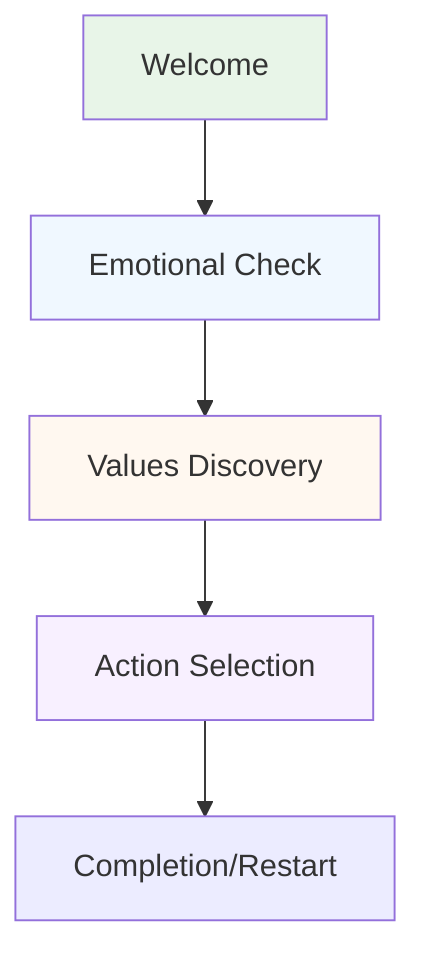

# Akcelerátor Altruismu - Project Structure

## 📁 Project Overview
This is a Czech/English altruistic guide app built with Streamlit. It helps users move from feelings of helplessness to concrete altruistic action through a gentle, step-by-step journey.

## 🏗️ Architecture
The app follows a **linear journey pattern** - users progress through 4 main steps without complex navigation.

## 📂 Directory Structure

```
streamlit-app/
├── 📄 app.py                    # Main entry point
├── 📄 content.py                # ✨ CENTRALIZED CONTENT - Edit all text here
├── 📄 requirements.txt          # Python dependencies
├── 📄 run_app.cmd              # Windows startup script
│
├── 📁 core/                     # Core application logic
│   ├── journey.py              # Linear journey flow (main user experience)
│   ├── navigation.py           # Navigation utilities (legacy, minimal use)
│   └── session.py              # Session state management
│
├── 📁 components/              # Reusable UI components
│   ├── emergency_help.py       # Crisis support widget
│   └── poc_badge.py           # Proof-of-concept badges (hidden)
│
├── 📁 config/                  # Configuration files
│   ├── settings.py            # App settings and constants
│   └── styling.py             # CSS styles and theming
│
├── 📁 data/                    # Data files and loaders
│   ├── loaders.py             # Data loading utilities
│   ├── causes/                # Cause definitions
│   ├── czech/                 # Czech-specific data
│   └── international/         # International data
│
├── 📁 logic/                   # Business logic
│   ├── encouragement.py       # Encouragement message logic
│   ├── matching.py            # Action matching algorithms
│   └── tracking.py            # User journey tracking
│
├── 📁 utils/                   # Utility functions
│   └── localization.py        # Language/localization helpers
│
└── 📁 .streamlit/             # Streamlit configuration
    └── config.toml            # Streamlit app config
```

## 🎯 Key Files for Content Editing

### 📄 `content.py` - **MAIN CONTENT FILE**
**This is where you edit ALL user-facing text!**

```python
# Journey flow content (titles, buttons, messages)
JOURNEY_CONTENT = {
    'czech': { ... },
    'english': { ... }
}

# Emotional responses to user feelings
EMOTIONAL_RESPONSES = { ... }

# Encouragement messages
ENCOURAGEMENT_MESSAGES = { ... }

# Crisis support content
CRISIS_SUPPORT = { ... }
```

### 📄 `core/journey.py` - **Main User Flow**
Contains the 4-step linear journey:
1. Welcome
2. Emotional Check
3. Values Discovery  
4. Action Selection

### 📄 `components/emergency_help.py` - **Crisis Support**
Gentle, always-available crisis support widget.

## 🔄 User Journey Flow



## 🎨 Content Management

### ✅ To Edit Text Content:
1. **Open `content.py`**
2. **Find the relevant section** (JOURNEY_CONTENT, EMOTIONAL_RESPONSES, etc.)
3. **Edit the text** in Czech and/or English
4. **Save and restart the app**

### ✅ Content Structure:
- **`JOURNEY_CONTENT`** - All journey step texts, buttons, titles
- **`EMOTIONAL_RESPONSES`** - Responses to user emotional states
- **`ENCOURAGEMENT_MESSAGES`** - Motivational messages
- **`CRISIS_SUPPORT`** - Crisis support widget content

### ✅ Helper Functions:
```python
get_content('journey_content.welcome.title', 'czech')
get_emotional_response('overwhelmed', 'czech')
get_encouragement('general', 'czech')
```

## 🚀 Running the App

### Windows:
```cmd
run_app.cmd
```

### Manual:
```bash
cd streamlit-app
pip install -r requirements.txt
streamlit run app.py
```

## 🧹 Removed/Obsolete Components

The following were removed during the linear journey refactor:
- ❌ `pages/` directory (assessment.py, welcome.py, etc.)
- ❌ Complex navigation system
- ❌ Multi-page architecture
- ❌ Proof-of-concept badges (hidden but kept for compatibility)

## 🎯 Design Philosophy

### ✅ Linear Journey
- **One step at a time** - no overwhelming choices
- **Clear progression** - users always know where they are
- **Gentle guidance** - emotionally sensitive responses

### ✅ Content Principles
- **Emotionally warm but realistic** - no fake enthusiasm
- **Czech-first experience** - authentic local language
- **Trust-building** - transparent, no fake numbers
- **Gentle crisis support** - always available, never jarring

## 🔧 Technical Notes

### Session State Management
- `journey_step` - Current step in the journey
- `emotional_state` - User's selected emotional state
- `selected_values` - User's chosen value areas
- `language` - Current language ('czech' or 'english')

### Styling
- **Hidden Streamlit UI** - sidebar, menu, footer all hidden
- **Custom CSS** - defined in `config/styling.py`
- **Responsive design** - works on mobile and desktop

## 🚨 Crisis Support
- **Always available** - gentle floating widget
- **Non-intrusive** - soft purple styling
- **Real resources** - actual Czech crisis hotlines
- **Multiple languages** - Czech and English support

## 📝 Future Development

### To Add New Content:
1. Add to `content.py` in appropriate section
2. Update helper functions if needed
3. Reference in journey steps using `get_content()`

### To Add New Journey Steps:
1. Add step handler in `core/journey.py`
2. Add content to `content.py`
3. Update journey flow logic

### To Modify Styling:
1. Edit `config/styling.py`
2. Update CSS in `app.py` if needed

## 🤝 Contributing

1. **Content changes** - edit `content.py`
2. **Logic changes** - edit relevant files in `core/` or `logic/`
3. **UI changes** - edit `core/journey.py` and `config/styling.py`
4. **Test thoroughly** - run through entire user journey

---

**Remember: This app transforms feelings of helplessness into meaningful action. Every change should honor that mission with warmth, authenticity, and respect for the user's emotional journey.** 